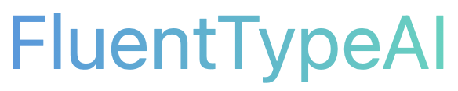
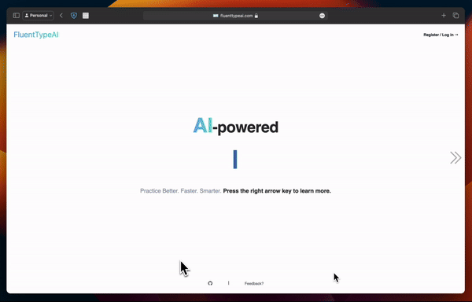

<h1 align="center">
   
  
   
</h1>

A simple touch-typing practice tool that uses AI to predict your next typing mistake **_before you even make it_**, so you can correct it in real-time.

*>>> Minimalist.*  
*>>> Personalized.*  
*>>> No ads, no tracking, no BS.*

FluentTypeAI differs from other typing practice sites because it's helping you improve by learning your typing patterns, and giving you your tailored practice.

No cookie cutter bs - why practice what you already do so well and waste time? That is why FluentTypeAI will tailor your typing text to use words that contain your mistake patterns. It will highlight your 2-letter sequences you most often get wrong before you even start typing. It's predicting your mistakes in real-time. It's like having a personal typing coach, but without the cost or the hassle. 🚀

It's also open-source, so you can see exactly what's happening under the hood. No black boxes. 🕵️‍♂️

---

## Features

- **Personalized Practice**: FluentTypeAI collects your most common 2-letter mistakes and uses them to generate practice text that is tailored to your needs - meaning he more you mess up "th" and "he", the more you'll see them in your practice text.
- **Weekly Leaderboard**: Compete with others and see how you rank in the weekly leaderboard.
- **Stats**: Track your progress and see how you're improving over time.

## Demo

  

> [!NOTE]  
> OpenAI integration is coming soon! 🤖
> Lots more features coming, [click here if you want to pitch in!](https://s.surveyplanet.com/k6vwmtct)

---

## Stack

- **Frontend**: React + Next.js + TailwindCSS
- **Backend**: MongoDB
- **AI**: CNN + LSTM in PyTorch
- **Hosting**: Vercel

Fully open-source, MIT licensed. Feel free to use any part of the code in your own projects! 🤓

---

## Contributing

Thank you for considering contributing to the project! I appreciate any help, whether it's in the form of code (PR), documentation, bug reports, or suggestions!

Here's a feedback form if you have any suggestions or ideas: [Click here!](https://s.surveyplanet.com/k6vwmtct). We will reach out to first 100 people who fill out the form and give them a free lifetime subscription to the paid version of the app!

If you want to talk more, you can find us here:  **`fluenttypeai AT gmail DOT com`**

Happy practicing! 🥳

---

## Attributions

- Wonderful README badges provided by: [shields.io](https://shields.io/)
- Keyboard UI inspiration: [typings.gg](https://github.com/briano1905/typings)
- Heroicons: [heroicons.com](https://heroicons.com/)
- GIF maker: [ezgif.com](https://ezgif.com)
- Screen Studio: [screen.studio](https://screen.studio)
